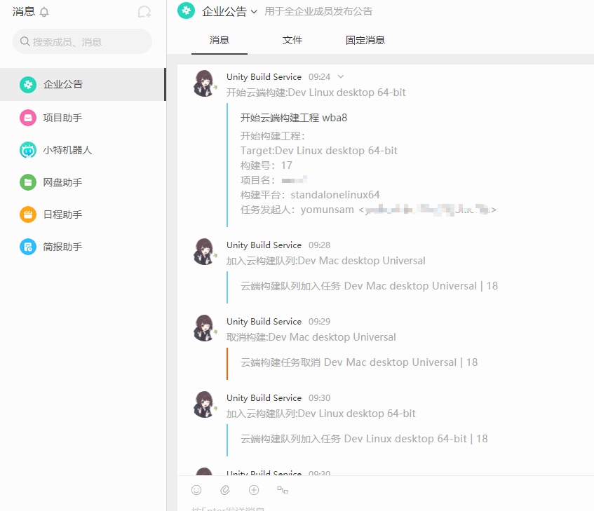

# Unity Cloud Build Service Webhook to Worktile with aliyun serverless fc

利用阿里云`函数计算`将Unity Cloud Build Service的webhook与项目管理工具worktile联动的推送工具。

原理：

`Unity Cloud` ---webhook---> `aliyun serverless [this app]` ---webhook---> `worktile`

使用方法：

把这个工程上传到阿里云函数计算，http触发。

设置函数入口为

`push2worktile::Nekonya.CloudBuild2Worktile::HandleRequest `

然后给函数计算设置环境变量

| 环境变量名 | 说明 | 可留空 |
|---------|----|----|
|worktile_url| 指定worktile的webhook 路径| `false`|
|author_name| worktile webhook 文档里的 author_name | `true`|
|author_link| worktile webhook 文档里的 author_link | `true`|
|author_icon| worktile webhook 文档里的 author_icon | `true`|

截图

